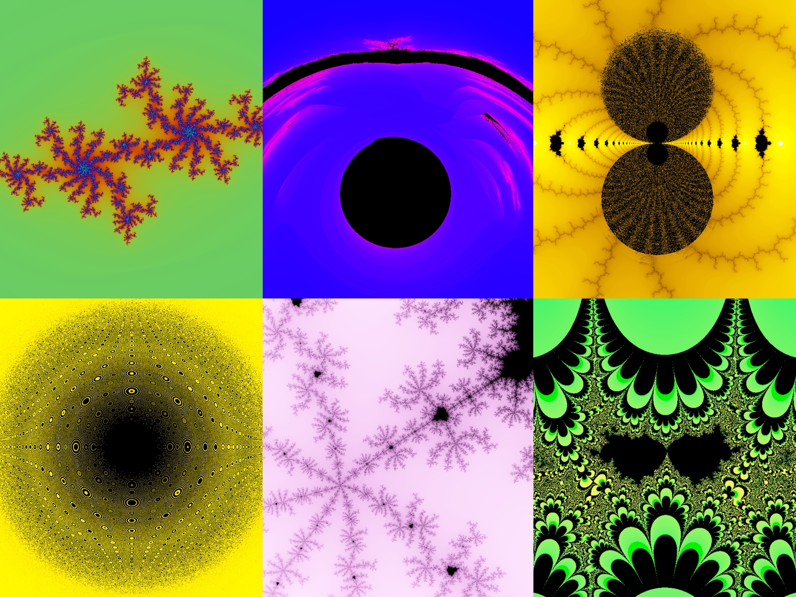

# fractal.gen

Simple WebGL tool for generating fractals using escape-time algorithm. Supports dynamic generation, animations, centering, dragging, zooming and comes with some predefined fractals you can play with.

### [PLAY HERE](https://peterminant.github.io/fractal.gen/)

### Algorithm
Having:

- generating function **G** in complex plane
- starting point **z0** in complex plane
- escape radius **R**
- iteration limit **N**
- coloring function **RGB**

Repeatedly apply G to z0 and form a sequence zn+1 = G(zn) until you find zk where |zk| > R, k ≤ N.
Then set the pixel color to RGB(k/N) or to black color if zk was not found.

### Generator Specifics

Editor uses GLSL to define functions and parameters, where **c()** and **rgb()** are simple aliases for vec2 and vec3 constructors.

Predefined variables:

- **px** - position of the pixel in complex plane
- **t** - time in seconds since animation started
- **k** - number of iterations until z escapes the closed disk with radius R
- **kn** - k normalized to [0, 1], kn = k / N

Use px within definition of G or z0 and k or kn within definition of RGB.

Predefined constants and complex functions:

zero, one, i, pi, e,
cadd, csub, cmul, cdiv, cinv,
cabs, cexp, clog, cpow, csqrt,
csin, ccos, ctan, ccot, csec, ccsc,
casin, cacos, catan, cacot, casec, cacsc,
csinh, ccosh, ctanh, ccoth, csech, ccsch,
casinh, cacosh, catanh, cacoth, casech, cacsch
